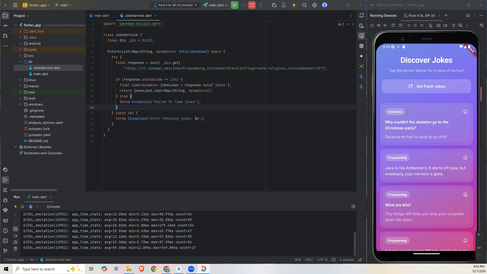

# Joke App

The Joke App is a Flutter-based mobile application that fetches and displays programming and Christmas-themed jokes from the JokeAPI. It features a modern, responsive UI with animated cards and a clean design. Users can tap a button to fetch new jokes, which are displayed in an easy-to-read format with support for both single-line and two-part jokes. The app uses Material Design 3 principles and handles both success and error states gracefully.


## Features

- Fetch random programming and Christmas jokes
- Beautiful Material Design 3 UI
- Smooth animations and transitions
- Error handling with user-friendly messages
- Support for both single and two-part jokes
- Responsive layout that works across devices
- Dark/Light theme support

## Configuration and Setup

### Prerequisites
- Flutter SDK (version: 3.24.3 or higher)
- Dart SDK (version 3.5.3 or higher)
- Android Studio or VS Code with Flutter extensions
- A physical device or emulator for testing


## Screenshots




## Installation
1. Clone the repository:
   ```bash
   git clone https://github.com/yourusername/joke_app.git 


## Running Tests

To run tests, run the following command

```bash
  cd Joke-App-Using-Flutter
  flutter pub get
  flutter run
```

